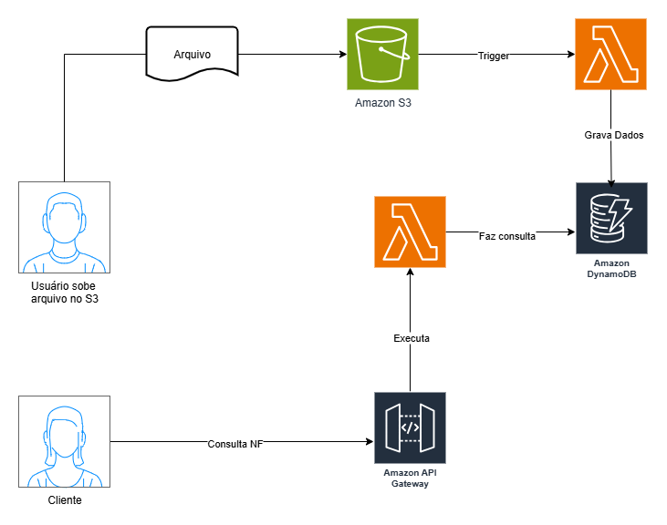
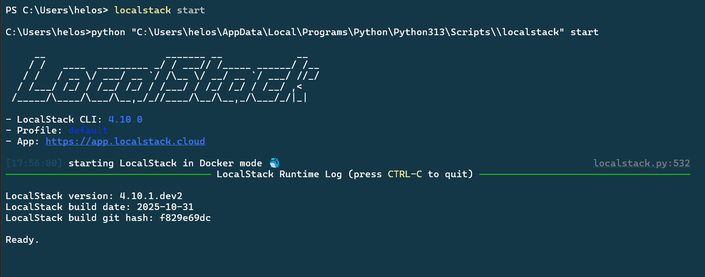

# Tarefas Automatizadas com Lambda Function e S3

Estudo em: November 2, 2025

## Projeto: Upload de Arquivos com Processamento e Registro no DynamoDB

### Fluxo do Projeto:

1. O usuário faz upload de um arquivo (ex: CSV ou JSON) em um bucket S3.
2. Um evento no S3 dispara uma Lambda Function escrita em Python.
3. A Lambda processa o conteúdo do arquivo (ex: extrai informações) e grava esses dados em uma tabela no DynamoDB
4. Outra função Lambda irá consultar a tabela e expor os dados por meio de uma API Gateway 

Sistema de Processamento de Notas Fiscais

- O usuário envia um arquivo JSON contendo informações de uma nota fiscal (número, cliente, valor, data, etc.).
- A Lambda lê e valida o arquivo, depois grava no DynamoDB os campos relevantes.



### Componentes AWS utilizados

- **Amazon S3:** Armazenamento dos arquivos
- **AWS Lambda:** Processamento dos arquivos
- **Amazon DynamoDB:** Armazenamento dos dados extraídos
- **IAM:** Gerenciamento de permissões
- (Opcional) **API Gateway:** Exposição de dados por API RESTful

## AWS Local com LocalStack

O **LocalStack** é uma plataforma que **emula localmente** os serviços da AWS.

Em outras palavras: ele cria uma **“AWS falsa” no seu computador**, onde você pode testar, desenvolver e simular interações com a nuvem **sem precisar acessar a AWS de verdade**.

É muito usada por desenvolvedores para testar APIs, lambdas, filas, buckets, e outros recursos — **sem gastar nada** e **sem precisar de conexão com a internet**.

### **Como funciona**

O LocalStack roda em **containers Docker** e simula vários serviços da AWS.

Você se conecta a ele usando as **mesmas ferramentas oficiais da AWS**, como:

- **AWS CLI**
- **SDKs (Python, Node.js, Java, etc.)**
- **Terraform** ou **CloudFormation**

Mas, em vez de mandar comandos para a AWS real, você manda para o **LocalStack**, que responde da mesma forma.

### Conteiner rodando no docker




### Criação do bucket S3

```powershell
aws s3 mb s3://notas-fiscais-upload --endpoint-url=http://localhost.localstack.cloud:4566
```


```powershell
# listar buckets
aws s3 ls --endpoint-url=http://localhost.localstack.cloud:4566
```

### Criação da tabela no DynamoDB

```powershell
aws dynamodb create-table --endpoint-url=http://localhost.localstack.cloud:4566 --table-name NotasFiscais --attribute-definitions AttributeName=id,AttributeType=S --key-schema AttributeName=id,KeyType=HASH --provisioned-throughput ReadCapacityUnits=5,WriteCapacityUnits=5
```


### Enviar arquivo para S3

```powershell
aws s3 cp notas_fiscais.json s3://notas-fiscais-upload/notas_fiscais.json --endpoint-url=http://localhost.localstack.cloud:4566
```

### Configurar o trigger S3

```powershell
aws lambda add-permission --function-name ProcessarNotasFiscais --statement-id s3-trigger --action "lambda:InvokeFunction" --principal s3.amazonaws.com --source-arn arn:aws:s3:::notas-fiscais-upload --endpoint-url=http://localhost.localstack.cloud:4566                                            
```

### Configurar o trigger usando AWS CLI:notifications.json

```powershell
aws s3api put-bucket-notification-configuration --bucket notas-fiscais-upload --notification-configuration file://notification.json --endpoint-url=http://localhost.localstack.cloud:4566
```

### Verificar trigger criada

```powershell
aws s3api get-bucket-notification-configuration --bucket notas-fiscais-upload --endpoint-url=http://localhost.localstack.cloud:4566
```

### Função Lambda funcionando e gravando no DynamDB


### Criação da API no API Gateway

```bash
aws apigateway create-rest-api --name "NotasFiscaisAPI" --endpoint-url=http://localhost.localstack.cloud:4566
```

Obetnha o ID do recurso raiz:

```bash
aws apigateway get-resources --rest-api-id gjr23suts8 --endpoint-url=http://localhost.localstack.cloud:4566
```

Crie o recurso /notas na API: (—parent-id com o ID do resultado no comando acima)

```bash
aws apigateway create-resource --rest-api-id gjr23suts8 --parent-id chxxhogdii  --path-part "notas" --endpoint-url=http://localhost.localstack.cloud:4566
```

Configure o método HTTP (POST ou GET): o recurso  /notas, vinculando-o à sua função Lambda:

```bash
aws apigateway put-method --rest-api-id gjr23suts8 --resource-id mwcy5vuest --http-method POST --authorization-type "NONE" --endpoint-url=http://localhost.localstack.cloud:4566
aws apigateway put-method --rest-api-id gjr23suts8 --resource-id mwcy5vuest --http-method GET --authorization-type "NONE" --endpoint-url=http://localhost.localstack.cloud:4566
```

Integre o método com Lambda

```bash
aws apigateway put-integration --rest-api-id gjr23suts8 --resource-id mwcy5vuest --http-method POST --type AWS_PROXY  --integration-http-method POST --uri "arn:aws:apigateway:us-east-1:lambda:path/2015-03-31/functions/arn:aws:lambda:us-east-1:000000000000:function:ProcessarNotasFiscais/invocations" --endpoint-url=http://localhost.localstack.cloud:4566
aws apigateway put-integration --rest-api-id gjr23suts8 --resource-id mwcy5vuest --http-method GET --type AWS_PROXY  --integration-http-method POST --uri "arn:aws:apigateway:us-east-1:lambda:path/2015-03-31/functions/arn:aws:lambda:us-east-1:000000000000:function:ProcessarNotasFiscais/invocations" --endpoint-url=http://localhost.localstack.cloud:4566
```

Conceder permissão à API para invocar a Lambda

```bash
aws lambda add-permission --function-name ProcessarNotasFiscais --statement-id apigateway-access --action "lambda:InvokeFunction" --principal apigateway.amazonaws.com --source-arn "arn:aws:execute-api:us-east-1:000000000000:abc123/*/POST/notas" --endpoint-url=http://localhost.localstack.cloud:4566
```

Implemente a API

```bash
aws apigateway create-deployment --rest-api-id gjr23suts8 --stage-name dev --endpoint-url=http://localhost.localstack.cloud:4566
```

Teste a API:

```bash
Invoke-RestMethod -Uri "http://localhost.localstack.cloud:4566/restapis/gjr23suts8/dev/_user_request_/notas" -Method POST -ContentType "application/json" -Body '{"id": "NF-999", "cliente": "João Silva", "valor": 1000.0, "data_emissao": "2025-01-31"}'
```