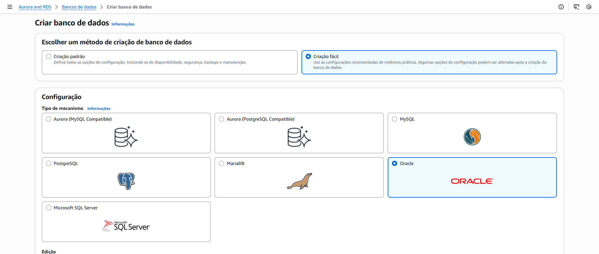

# Amazon RDS

Estudo em: October 21, 2025

## Banco de dados na AWS

Na AWS, bancos de dados podem ser gerenciados automaticamente — ou seja, você não precisa se preocupar com tarefas complexas como backup, atualização de versão, alta disponibilidade e escalabilidade manual.
O principal serviço para isso é o Amazon RDS (Relational Database Service).

## O que é Amazon RDS?

O **Amazon RDS** é um serviço que facilita o uso de **bancos de dados relacionais** na AWS.

Ele é **gerenciado**, ou seja, a AWS cuida automaticamente de:

- Backup automático
- Alta disponibilidade (Multi-AZ)
- Atualizações de segurança
- Escalabilidade (aumentar capacidade com poucos cliques)
- Monitoramento de performance

> Você só foca **na aplicação e nos dados**, não na infraestrutura.
> 

## Tipos de banco de dados suportados pelo RDS

1. **Amazon Aurora**: é um mecanismo de banco de dados relacional compatível com MySQL e PortgreSQL que combina a velocidade e a disponibilidade dos bancos de dados comerciais com a simplicidade e a economia dos bancos de dados de código aberto. Oferecendo um desempenho até cinco vezes melhor do que o MySQL, com a segurança, a disponibilidade e a confiabilidade de um banco de dados comercial a um décimo do custo.
2. **Oracle**: o Amazon RDS permite que você implante várias edições do Oracle Database em minutos. Você pode trazer as licenças Oracle existentes ou pagar uso da licença por hora. O RDS permite que você se concentre no desenvolvimento de aplicativos, gerenciando tarefas complexas de administração de banco de dados, incluindo provionamento, backups, aplicação de patches, monitoramento e dimensionamento de hardware.
3. **Microsoft SQL Server**: o Amazon RDS para SQL Server facilita a configuração, a operação e o dimensionamento do SQL Server na nuvem. Como o Amazon RDS for SQL Server fornece acesso direto aos recursos nativos do SQL Server, os aplicativos e ferramentas devem funcionar sem nenhuma alteração.
4. **MySQL**: o MySQL é um sistema de gerenciamento de banco de dados relacional (RDBMS) de código aberto usado por um grande número de aplicativos baseados na Web. O Amazon RDS para o MySQL lhe dá acesso aos recursos de um mecanismo de banco de dados MySQL, os aplicativos e as ferramentas que você já usa hoje com seus bancos de dados existentes podem ser usados com o Amazon RDS sem nenhuma alteração.
5. **PostgreSQL**:  é um poderoso sistema de banco de dados objeto-relacional de código aberto, com ênfase na extensibilidade e na conformidade com os padrões. O PostgreSQL possui recursos sofisticados e executa procedimentos armazenados em mais de uma dúzia de linguagens  de programação, incluindo Java, Perl, Python, Ruby, Tvl, C/C++, e seu próprio PL/pgSQL, que é semelhante ao PL/SQL da Oracle.
6. **MariaDB**: é um mecanismo de banco de dados compatível com o MySQL, que é uma bifurcação do MySQL e está sendo desenvolvido pelos desenvolvedores originais do MySQL. O Amazon RDs facilita a configuração, a operação e o dimensionamento das implantações do MariaDB na nuvem.

# Criação de um banco de dados

### Configuração

>💡 É possível vincular o banco de dados à uma instância EC2

