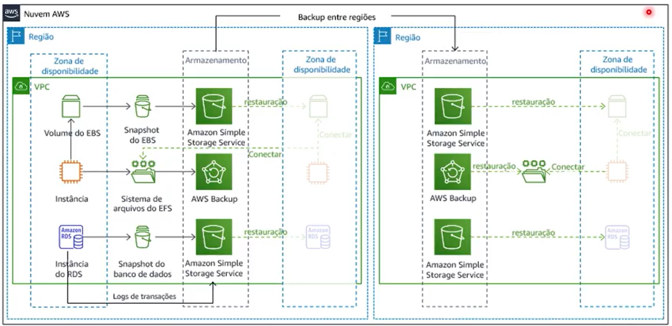

# Estratégias de Backups e Recuperação de Dados

Estudo em: October 21, 2025

## Backup de dados

Um backup de dados é uma cópia dos dados do sistema, da configuração ou de aplicativos que é armazenada separadamente do original.

As vezes por conta de imprevistos como desastres naturais, erros humanos, eventos de segurança ou falhas no sistema. O backup de dados é uma função essencial de proteção de dados para diminuir o risco de perda total ou parcial de dados no caso de eventos inesperados.

### Por que o backup de dados é importante?

O backup de dados é crucial porque sistemas podem falhar, e falhas no sistema, embora raras, são possíveis. O backup envolve copiar dados organizacionais para restauração em caso de falhas, incluindo um plano de recuperação de desastres. 

É essencial para previnir perda de dados, garantir a continuidade dos negócios, reduzir custos, cumprir contratos, manter históricos de versões e atender a requisitos de conformidade e auditoria

## Definindo a estratégia

Uma estratégia de backup de dados envolve várias etapas para garantir a segurança, disponibilidade e recuperação dos dados.

1. Avaliação e planejamento
    - Identificar dados críticos: determine quais dados são críticos e  precisam ser protegidos.
    - Definição de RPO e RTO: Estabeleça os Objetivos de Ponto de Recuperação (RPO) e Objetivos de Tempo de Recuperação (RTO) para cada conjunto de dados.
        - O RPO tem a ver com dados e arquivos e a margem que pode ser perdida entre os ciclos de backup realizados diariamente, semanalmente, mensalmente.
        - o RTO é ligado ao limite de tempo que o sistema como um todo, de forma mais abrangente, pode ficar parado antes que tudo volte a funcionar adequadamente.

1. Seleção de Serviços AWS
    - Podemos utilizar o Amazon S3 para armazenar backups.
    - Temos também o AWS Backup para gerenciar e automatizar os backups dos nossos serviços na AWS.

1. Implementação da Estratégia de backup
    - Backups Regulares: configurar backups automáticos diários para dados críticos e backups incrementais para otimizar o uso de armazenamento e tempo;
    - Cópias de segurança em múltiplas regiões: para maior resiliência, armazene cópias de segurança em várias regiões AWS usando a replicação entre regiões do S3;
    - Automação e Monitoramento: use AWS Lambda e AWS CloudWatch para automatizar backups e monitorar a integridadde e o status dos backups.
    - **Backups automáticos (Managed pela AWS)**
        - A AWS faz snapshots automaticamente diariamente.
        - Você pode escolher por quantos dias deseja **reter esses backups** (ex: 7, 15, 30 dias).
        - **Exemplo com RDS:** Se o banco cair ou alguém apagar uma tabela, você pode **restaurar o banco exatamente como estava ontem às 03h00**, por exemplo.
        - **No DynamoDB:** usa o **Point-in-Time Recovery (PITR)**, que permite restaurar **para qualquer segundo específico** nas últimas 24h ou mais.
        
2. Recuperação e Teste
    
    Documente e implemente planos detalhados para diferentes cenários de falha, faça teste regulares. Realize testes de recuperação de backups regularmente para garantir que os dados possam ser restaurados rapidamente e de forma eficaz.
    
    - Backup Drill: conduza exercícios de desastres para validar a eficácia dos planos de recuperação.

1. Segurança e Conformidade
    - Criptografia de Dados: use criptografia em trânsito (TLS) e em repouso (S3 Server-Side Encryption, RDS Encryption) para proteger dados sensíveis.
    - Controle de acesso: configure políticas do IAM para restringir o acesso aos backups apenas para usuários autorizados.
    - Registros e Auditorias: utilize AWS CloudTrail para registrar atividades e garantir conformidade com requisitos regulatórios.

1. Custo e Otimização
    - Gestão de custos: utilize as ferramentas de análise de custo da AWS, como o AWS Cost Explorer, para monitorar e otimizar os gastos com backup.
    - Gerencie o Ciclo de vida através de políticas movendo os dados entre diferentes classes de armazenamento. Afine o seu custo até caber em seu bolso!

