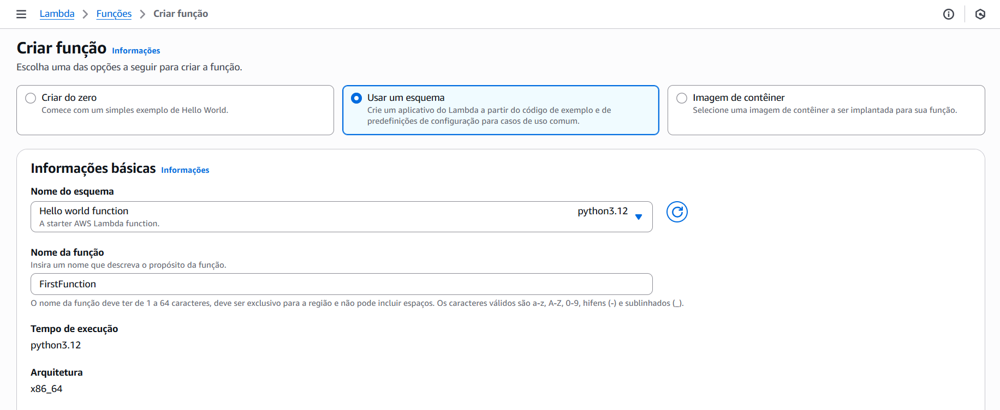

# Criando um Hello World com Lambda

Estudo em: October 15, 2025

## Definições básicas

## Fazer deploy quando alterar alguma coisa

## Monitor de logs

## Adicionar Trigger (gatilho)

Pode ser configurado para o bucket todo ou só um tipo de arquivo