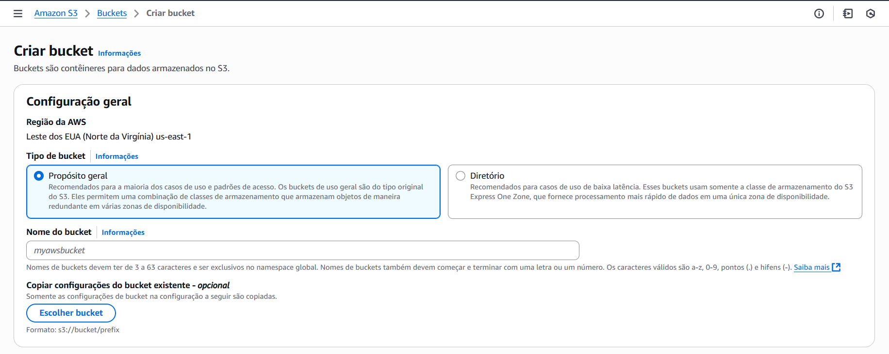

# Criando primeiro bucket no S3

Estudo em: October 7, 2025 5:59 PM




## Pastas do bucket


## Dando permissão para o bucket ficar público


```json
{
	"Version": "2012-10-17",
	"Statement": [
		{
			"Sid": "PublicReadGetObject",
			"Principal": "*",
			"Effect": "Allow",
			"Action": [
				"s3:GetObject"
			],
			"Resource": "arn:aws:s3:::desafioawsantander/*" // seu bucket arn - /* da acesso a tudo dentro do bucket
		}
	]
}
```

## Logo depois criar um ponto de acesso

