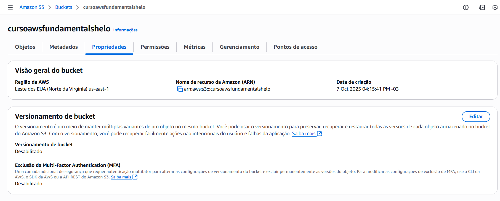

# Versionamento do Bucket S3

Estudo em: October 7, 2025

https://docs.aws.amazon.com/AmazonS3/latest/userguide/versioning-workflows.html

O **versionamento (versioning)** é um **recurso opcional** do Amazon S3 que permite **manter várias versões de um mesmo objeto** em um bucket.

Quando o versionamento está **habilitado**, o S3 **nunca sobrescreve nem deleta permanentemente um objeto** — ele guarda o histórico de todas as versões.

### 📚 Exemplo prático

Imagina que você tem um bucket chamado `meus-arquivos` e dentro dele um arquivo:

```
relatorio.pdf
```

1. Você envia (upload) o arquivo pela primeira vez.
    
    → O S3 cria a **versão 1** (com um `Version ID` específico).
    
2. Depois, você faz upload novamente com o mesmo nome `relatorio.pdf`.
    
    → O S3 **não substitui** o arquivo antigo.
    
    → Ele cria uma **nova versão (versão 2)** e mantém a anterior guardada.
    
3. Se alguém apagar o `relatorio.pdf`, o S3 **não apaga de verdade** — apenas adiciona um **“delete marker”** (um tipo especial de versão que marca o arquivo como excluído).
    
    → Você ainda pode restaurar versões anteriores se quiser.
    

---

### ⚙️ Como habilitar o versionamento

Você pode fazer isso de três formas:

- **Pelo Console AWS:**
    - Acesse o bucket → guia “Properties” (Propriedades)
    - Encontre a seção **Bucket Versioning**
    - Clique em **Enable Versioning**
- **Via AWS CLI:**
    
    ```bash
    aws s3api put-bucket-versioning --bucket nome-do-seu-bucket --versioning-configuration Status=Enabled
    ```
    
- **Via SDK (exemplo em C#):**
    
    ```csharp
    var request = new PutBucketVersioningRequest
    {
        BucketName = "meu-bucket",
        VersioningConfig = new S3BucketVersioningConfig { Status = "Enabled" }
    };
    await client.PutBucketVersioningAsync(request);
    ```
    



### 🧠 Benefícios

✅ Protege contra exclusão ou sobrescrita acidental.

✅ Permite restaurar versões anteriores de arquivos.

✅ Ajuda em auditorias e histórico de mudanças.

> - Cada versão **ocupa espaço de armazenamento**, ou seja, **pode gerar custo extra**.
>- O versionamento **não pode ser totalmente desativado** depois de habilitado — apenas **suspenso** (`Suspended`), o que faz o S3 parar de criar novas versões, mas manter as antigas.

### 💡 Dica extra

Você pode combinar o versionamento com **regras de ciclo de vida (Lifecycle Rules)** para:

- Mover versões antigas para o **S3 Glacier** (armazenamento frio e barato),
- Ou deletar versões antigas automaticamente após um tempo.