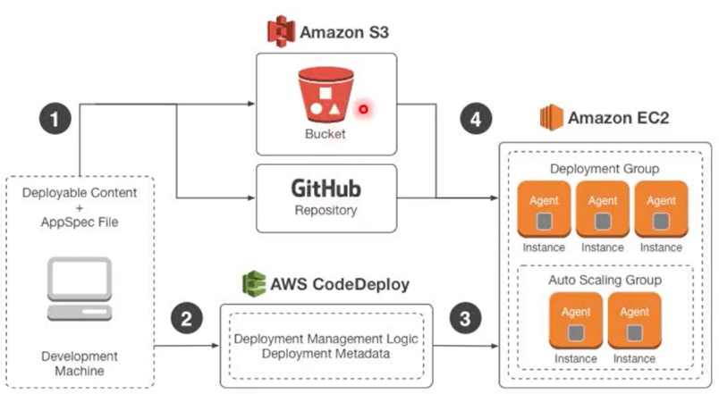

# AWS CodeDeploy

Estudo em: November 2, 2025

O **AWS CodeDeploy** é um serviço totalmente gerenciado da AWS que **automatiza o processo de implantação (deploy)** de aplicações em diferentes ambientes.

Ele garante que as atualizações sejam feitas de forma **segura, eficiente e sem tempo de inatividade**, seja em **instâncias EC2**, **Lambda**, **ECS** ou até **servidores locais** (on-premises).

Pense nele como uma **“esteira automatizada” de implantação**: você coloca seu aplicativo no início e, no final, ele já está atualizado e rodando em todos os servidores.

### **Como o CodeDeploy funciona**

1. **Prepara o aplicativo** — Ele identifica os arquivos e scripts que serão atualizados.
2. **Distribui o código** — Faz o envio automático para os destinos configurados (EC2, S3, Lambda, etc.).
3. **Executa as etapas de implantação** — Pode rodar scripts de pré e pós-implantação.
4. **Monitora o processo** — Acompanha logs, erros e status de cada instância em tempo real.
5. **Permite rollback automático** — Se algo der errado, ele reverte para a versão anterior.

### **Benefícios do AWS CodeDeploy**

1. **Automatiza as implantações de software**
    - Elimina a necessidade de deploys manuais.
    - Reduz falhas humanas e garante consistência nas atualizações.
    - Permite implantar em várias instâncias simultaneamente.
2. **Aumenta a velocidade e a eficiência**
    - Facilita lançamentos contínuos (CI/CD).
    - Reduz o tempo de disponibilização de novas versões.
    - Ideal para equipes que seguem metodologias ágeis ou DevOps.
3. **Garante disponibilidade e escalabilidade**
    - Suporta **implantação sem interrupção** (rolling update, blue/green deployment).
    - Integra-se com balanceadores de carga e escalonamento automático.
    - Mantém o sistema acessível mesmo durante atualizações.
4. **Integra-se com outros serviços da AWS**
    - Compatível com **Amazon EC2**, **Elastic Load Balancing**, **AWS Lambda**, **Amazon S3**, **CodePipeline** e **CloudWatch**.
    - Permite criar pipelines completas e monitorar todo o processo de deploy em tempo real.

### **Tipos de Implantação no CodeDeploy**

| Tipo | Descrição |
| --- | --- |
| **In-place deployment** | Atualiza o aplicativo diretamente nas instâncias existentes. |
| **Blue/Green deployment** | Cria um novo conjunto de instâncias (versão "green") enquanto mantém a antiga (versão "blue"), redirecionando o tráfego apenas quando a nova versão estiver pronta. |
| **Lambda deployment** | Atualiza as versões das funções Lambda sem downtime. |

### **Exemplo de Fluxo de Uso**

1. O código é armazenado em um repositório (como GitHub ou CodeCommit).
2. O CodeDeploy pega o código e os arquivos de configuração (`appspec.yml`).
3. Ele envia o código para as instâncias EC2.
4. Scripts de inicialização são executados.
5. O CodeDeploy monitora e confirma o sucesso da implantação.