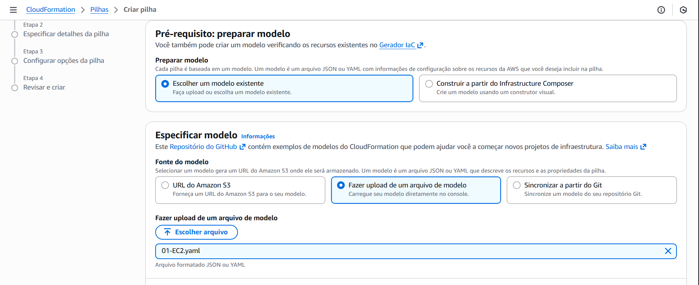

# Implementando sua Primeira Stack com AWS CloudFormation

Estudo em: October 29, 2025


O AWS CloudFormation é o serviço de **Infrastructure as Code (IaC)** da AWS.

Em vez de criar seus recursos (como servidores EC2, bancos de dados RDS, redes VPC) manualmente, um por um, clicando no console, você **escreve um arquivo de texto** (um "template") que descreve *tudo* o que você quer.

O CloudFormation então lê esse "blueprint" e **constrói (provisiona) automaticamente** toda a infraestrutura para você, na ordem correta.

### Vantagens Principais

- **Automatização:** Cria e deleta ambientes inteiros com um comando.
- **Consistência:** Garante que seu ambiente de teste seja uma cópia exata do de produção, eliminando o "mas funcionava na minha máquina!".
- **Velocidade:** Provisiona infraestruturas complexas em minutos, em vez de dias.
- **Documentação Viva:** O próprio template **é** a documentação. Você sabe exatamente o que está rodando em produção apenas lendo o arquivo.
- **Versionamento:** Você pode salvar seu template no **Git**, ver o histórico de quem mudou o quê na infraestrutura e quando.

### Como Funciona

1. **Escrever o Template (O Blueprint):**
Você escreve um arquivo de texto em formato **YAML** (mais comum e legível) ou **JSON**. Neste arquivo, você declara os recursos que deseja.
    - "Eu quero 1 Instância EC2 do tipo `t3.micro`."
    - "Eu quero 1 Bucket S3 chamado `meu-app-data`."
    - "Eu quero 1 Security Group que libere a porta 80."
2. **Criar um "Stack" (A Construção):**
Você faz o upload desse template para o CloudFormation e manda ele "criar um Stack".
    - Um **Stack** é o conjunto de todos os recursos que o CloudFormation criou a partir do seu template. É a "casa" construída a partir da "planta".
3. **Atualizar ou Deletar (A Reforma ou Demolição):**
    - **Precisa mudar algo?** (Ex: Mudar a instância de `t3.micro` para `t3.small`). Você **não** mexe no console. Você **muda o arquivo de template** e manda o CloudFormation "atualizar o Stack". Ele descobre o que mudou e aplica *apenas* aquela mudança.

## Configurando a primeira stack

- [Template EC2](../../../Desafios%20e%20Exercicios/CloudFormation/01-EC2.yaml)
- [Template Apache](../../../Desafios%20e%20Exercicios/CloudFormation/02-Apache.yaml)
- [Template Firewall](../../../Desafios%20e%20Exercicios/CloudFormation//03-Firewall.yaml)

### 1. Preparar template .yaml com todos os recursos desejados

Exemplo simples de criação de instância

```yaml
Description: Criar um Amazon EC2 simples
Resources:
  Instance:
    Type: AWS::EC2::Instance
    Properties:
      AvailabilityZone: us-east-1a
      ImageId: ami-0ed9277fb7eb570c9
      InstanceType: t2.micro
```

### 2. Fazer o upload do modelo no console



### 3. Dar um nome para a stack (pilha)


### 4. Configurar permissões adicionais


### 5. Revisar e criar stack


### Stack criada e executada


