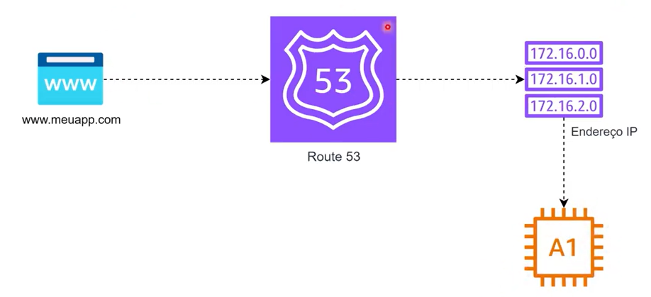

# O que é Amazon Route 53?

Criado por: Helo Salgado
Criado em: October 15, 2025 2:28 PM
Categoria: Redes na AWS
Última atualização em: October 15, 2025 2:58 PM

O **Amazon Route 53** é o **serviço de DNS (Domain Name System)** da AWS.

Ele é responsável por **traduzir nomes de domínio (como www.meusite.com)** em **endereços IP**, que são usados para localizar e acessar recursos na internet.

Em outras palavras:

> O Route 53 conecta o nome do seu site ao servidor onde ele está hospedado.
> 

### Funções principais

O Route 53 tem **três funções principais**:

1. **Gerenciamento de Domínios**
    
    Você pode **registrar** um novo domínio (como `meusite.com`) diretamente pela AWS.
    
2. **Roteamento de Tráfego**
    
    Ele decide **para onde o tráfego deve ser enviado** quando alguém acessa seu domínio.
    
    Existem diferentes **tipos de roteamento**, como:
    
    - **Simple Routing:** envia o tráfego para um único destino.
    - **Weighted Routing:** divide o tráfego entre vários recursos (para testes ou balanceamento).
    - **Failover Routing:** redireciona o tráfego automaticamente se um recurso falhar.
    - **Latency-based Routing:** envia o usuário para a região com menor latência (melhor desempenho).
3. **Verificação de Saúde (Health Checks)**
    
    O Route 53 pode **monitorar a disponibilidade** dos seus recursos e **desviar o tráfego automaticamente** se algo estiver fora do ar.