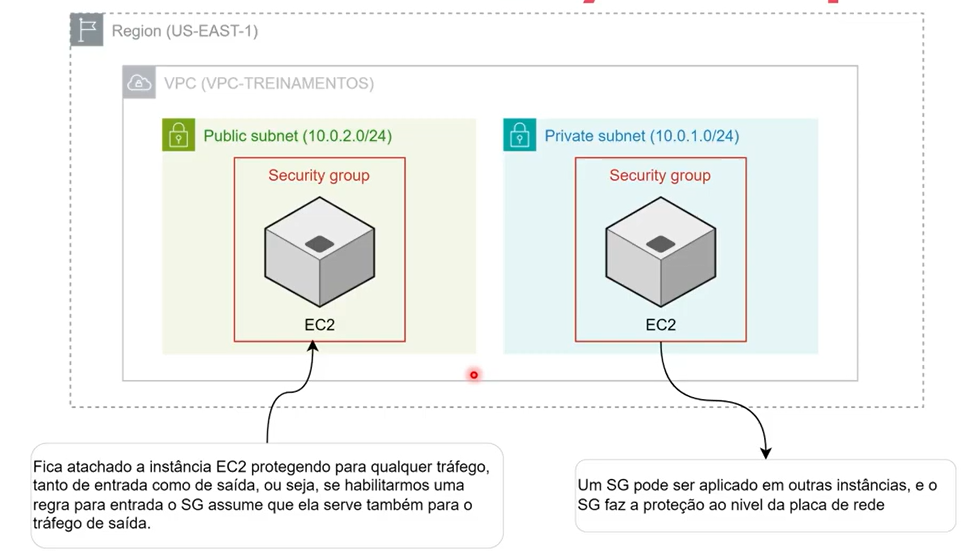

# O que é Amazon Security Group?

Estudo em: October 15, 2025

O **Amazon Security Group** é um **firewall virtual** que controla o **tráfego de rede de entrada e saída** dos recursos dentro da sua **VPC (Virtual Private Cloud)** — como instâncias EC2, bancos de dados e outros serviços.

É através deste serviço que habilito permissões de acesso em minha instância, por exemplo:

- Acesso via SSH, RDP

### Como funciona

- Os **Security Groups** funcionam no **nível da instância** (por exemplo, uma máquina EC2).
- Você **cria regras** que **autorizam** conexões de entrada (**inbound**) e saída (**outbound**).
- Cada regra pode especificar:
    - **Protocolo:** TCP, UDP, ICMP etc.
    - **Porta:** por exemplo, 80 (HTTP), 443 (HTTPS) ou 22 (SSH).
    - **Origem/Destino:** outro Security Group, um IP específico ou uma faixa de IPs.
    

> ⚠️ O Security Group **bloqueia tudo por padrão**.
> Você precisa **permitir explicitamente** o tráfego que deseja liberar.
