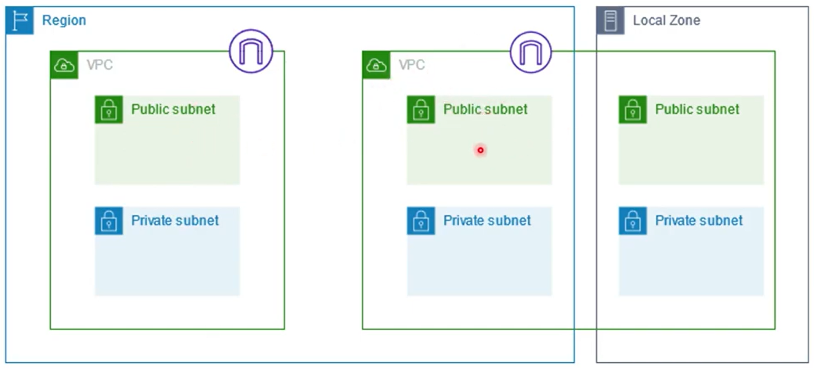

# O que é Amazon Subnet?

Estudo em: October 15, 2025

A Amazon Subnet é uma divisão lógica dentro da Amazon VPC.
Ela serve para organizar e isolar os recursos da sua rede, como instâncias EC2, bancos de dados e aplicações.

Cada subnet fica associada a uma zona de disponibilidade (Availability Zone) — ou seja, você pode distribuir recursos em diferentes partes da infraestrutura da AWS para aumentar a disponibilidade e resiliência.

É dentro de subnets que são criados os grupos de segurança (security groups - SG) também os protocolos e IPs podem acessar os nossos recursos através do inbound rules e para quais IPs e protocolos os seus recursos podem se conectar (outbound rules).