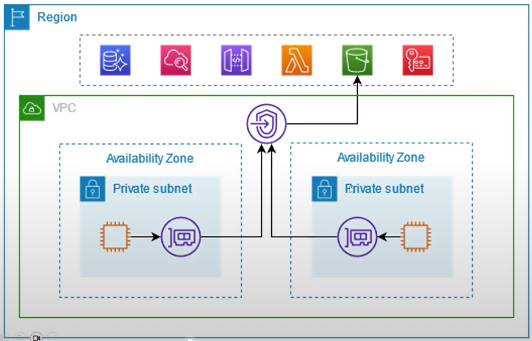

# Introdução à Amazon VPC

Estudo em: October 15, 2025
https://docs.aws.amazon.com/pt_br/vpc/latest/userguide/vpc-example-private-subnets-nat.html

## Redes na AWS

As **redes na AWS** são a base da comunicação entre os recursos (como servidores, bancos de dados e aplicações). Elas são configuradas principalmente dentro do serviço **Amazon VPC (Virtual Private Cloud)**, que permite criar uma **rede virtual isolada** dentro da nuvem da AWS.

### Isolamento de serviços

Esse é um **conceito fundamental** em redes na AWS.

Você pode **isolar determinados serviços** para garantir segurança e controle de acesso:

- **Serviços com acesso externo:**
    
    Ficam em **sub-redes públicas** (public subnets), com acesso à internet — por exemplo, um site ou API que usuários precisam acessar.
    
- **Serviços com acesso interno:**
    
    Ficam em **sub-redes privadas** (private subnets), sem acesso direto à internet — por exemplo, um banco de dados ou sistema interno que só outros serviços da VPC podem acessar.
    

## Amazon VPC (Virtual Private Cloud)

A **Amazon VPC** é um serviço que permite criar uma **rede virtual privada** dentro da AWS. Ela funciona como uma parte isolada da nuvem onde você pode definir **como seus recursos se comunicam entre si** e com o mundo externo.

Essa rede é similar a uma rede tradicional de datacenter, mas com a flexibilidade e escalabilidade ofericidas pela infraestrutura da AWS.

A Amazon VPC possibilita a criação de sub-redes em diferentes zonas de disponibilidade dentro de uma região, açém de fornecer um gateway da internet para facilitar a comunicação;

Com a VPC, você tem **controle total sobre o ambiente de rede**, podendo escolher:

- O intervalo de endereços IP (IPv4 e IPv6);
- A criação de **sub-redes** (públicas ou privadas);
- As **tabelas de rotas**;
- E as **regras de segurança**.
- Conectividade: com redes locais usando VPNs ou conexões dedicadas, estendendo a rede local para a nuvem da AWS.

Isso é essencial para **integrar sistemas** de forma segura e organizada, garantindo que cada serviço só tenha o tipo de acesso que realmente precisa.

