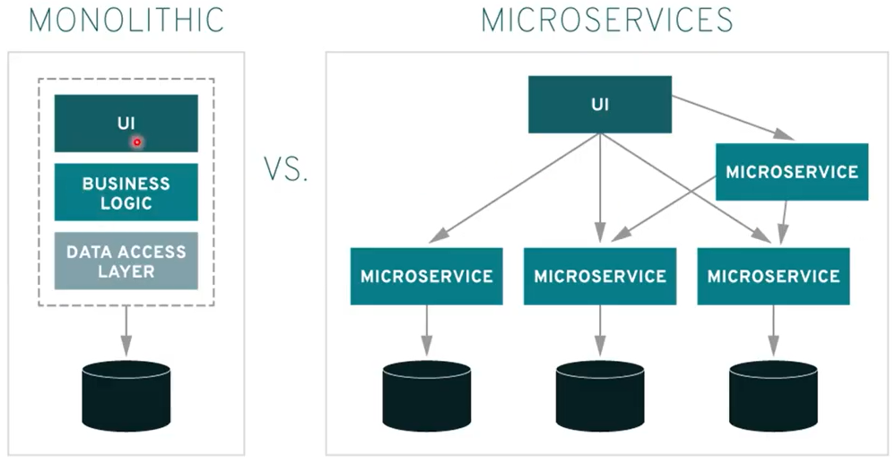

# O que são Amazon ECS e EKS na Orquestração de Container

Estudo em: October 22, 2025

## Microserviços

É um estilo de arquitetura onde o sistema **não é um único bloco gigante**, mas sim **dividido em vários serviços independentes**, cada um responsável por **uma função específica do negócio**.

- Cada microserviço é um **projeto isolado** com seu **próprio repositório**, **deploy independente**, e **não compartilha banco nem código com os outros**.
- Eles **se comunicam via HTTP/REST, gRPC, mensageria, eventos…**
- Se **um serviço cair**, os outros continuam funcionando (desde que bem desenhado).
- Muito usado para **alta escalabilidade**, **resiliência**, **agilidade de desenvolvimento**

| Arquitetura Monolítica | Arquitetura de Microserviços |
| --- | --- |
| Uma **empresa pequena**, onde todo mundo faz de tudo | Uma **empresa grande e organizada**, cada setor tem sua função |
| Um **único código**, tudo junto (se muda uma parte, pode quebrar outra) | **Vários serviços independentes**, cada um mantém seu próprio ciclo de vida |
| **Um banco de dados pra tudo** | **Cada serviço pode ter seu próprio banco** |
| Escala tudo junto (mesmo se só 1 função precisa crescer) | Escala só o serviço necessário (ex: só o “pedido” fica mais lento? escalo só ele) |

## ECS - Amazon Elastic Container Service

O ECS é um serviço gerenciado de orquestração de contêineres que permite executar, interromper e gerenciar facilmente contêineres em um cluster.

Permite executar aplicações em contêineres em uma arquitetura de microservices, utilizando a escalabilidade, segurança e o desempenho da infraestrutura da AWS.

Ele decide:

- **onde cada container vai rodar** (em qual máquina servidor)
- **quantos containers precisa subir**
- **reinicia se algum container morrer**
- **escala automaticamente** se aumentar o tráfego
- **faz balanceamento de carga se necessário**

Ele gerencia containers em dois modos:

| Modo | Explicação |
| --- | --- |
| **EC2** | Você fornece os servidores (máquinas), ECS apenas distribui os containers nelas |
| **Fargate** | Serverless → você nem vê servidor → ECS simplesmente RODA os containers automaticamente |
- Você tem **vários microserviços**, cada um empacotado como **Docker**
- Você **manda pro ECS o container + regras (task definition)**
- O ECS **roda, escala, monitora e mantém esses containers vivos**

Monitoramento e Logging: utilizamos o Amazon CloudWatch para monitorar a performance e logs dos contêineres para troubleshooting e análise de desempenho.

Elastic Container Registry (ECR): serviço de registro de contêiner gerenciado para armazenar, gerenciar e implantar imagens do Docker.

- ECR armazena e gerencia versões de imagens Docker.
- ECS/EKS/Fargate puxam essas imagens de lá para rodarem os microserviços.
- É o Docker Hub oficial e integrado da AWS.

## EKS - Elastic Kubernetes Service

O AWS Elastic Kubernetes Service (EKS) é um serviço gerenciado que facilita a execução do Kubernetes na AWS sem a necessidade de instalar e operar seu próprio cluster Kubernetes.

Oferece uma forma segura, confiável e escalável de gerenciar contêineres usando Kubernetes, uma das plataformas de orquestração de contêineres mais populares.

### O que é Kubernetes Service?

O Kubernetes auxilia no ajuste do tamanho de um cluster necessário para executar um serviço.

Permitindo escalonar automaticamente seus aplicativos, para mais e para menos, com base na demanda e executá-los com eficiência.

O AWS EKS é mais adequado para organizações que já utilizam o Kubernetes ou estão considerando implementar essa tecnologia para aproveitar a força da infraestrutura da AWS e, ao mesmo tempo, reduzir os esforços vinculados à manutenção do ambiente Kubernetes.

> 👉🏾 Pois a gestão de um cluster Kubernetes é muito complexa.

## Amazon ECS VS Amazon EKS

|  | ECS | EKS |
| --- | --- | --- |
| Orquestrador | Proprietário da AWS | Kubernetes (padrão mundial) |
| Complexidade | Mais simples | Mais avançado |
| Flexibilidade | “Do jeito da AWS” | Total controle (infra nível Google/Azure/On-premises) |
| Usado por | Times menores e projetos 100% AWS | Grandes empresas, multi-cloud, nível enterprise |