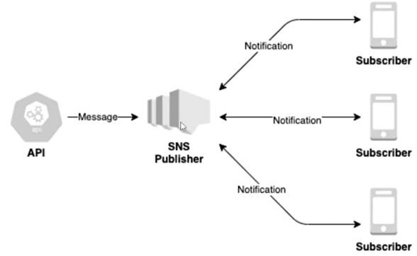
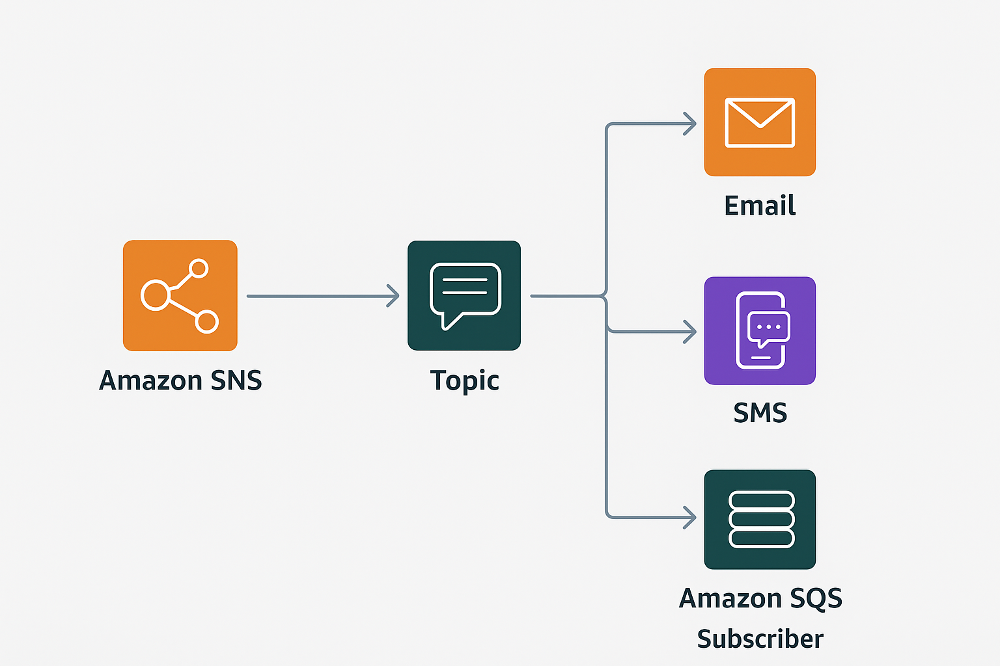

# Como funciona o Amazon SNS e SQS na Comunicação Assíncrona

Estudo em: October 23, 2025

## Amazon SNS - Simple Notification Service

Serviço **assíncrono** e **altamente escalável** para **notificações e broadcast** entre sistemas distribuídos, microserviços ou até usuários finais (push, SMS, e-mail).

Ele permite enviar notificações para:

- Dispositivos mobile (push)
- SMS / e-mail
- **SQS**, **AWS Lambda** (muito usado para automação/eventos)

### Tópicos

O **Publisher (produtor)** envia mensagens para um **tópico SNS**, e todos os **Subscribers (assinantes)** recebem.

Um tópico pode ser dividido em 2 tipos:

- Tipo Fifo (first in/first out)
    - Garante **ordem exata de entrega**
    - Garante **entrega única (não duplicada)**
    - **Limite: 300 publicações por segundo**
    - Ideal para **transações financeiras**, pedidos, cobrança
    
    
    
- Tipo Padrão
    - **Altíssima performance**
    - **Não garante ordem**
    - **Pode entregar mensagens duplicadas**
    - Ideal para **notificações em massa**, eventos gerais
    - Ex: “Novo pedido recebido → SNS notifica sistema de logística **e** dispara SMS para cliente”.

E isso é configurado no Subscriber que é onde recebe a mensagem.

## Amazon SQS - Simple Queue Service

Serviço de **fila de mensagens** para comunicação **segura e desacoplada** entre sistemas internos.

- Mantém mensagens **em fila até serem processadas**
- Após uma mensagem ser recebida, ela fica **invisível temporariamente** (evita duplicidade)
- “Suaviza picos de tráfego”: recebe rápido → processa no tempo do consumidor
- Tipos: **FIFO** e **Padrão** (assim como SNS)

> 👉🏾 SQS é muito usado para **microserviços pesados** (ex: processamento de imagem, pagamento, geração de nota fiscal)

## Amazon SQS X Amazon SNS

A escolha entre o Amazon SNS e o SQS exige que você tome uma decisão em relação ao gerenciamento das suas mensagens.

- O Amazon SNS funciona como um sistema de transmissão, o que o torna ideal para alertar rapidamente os usuários de um determinado produto.
- O Amazon SQS funciona como uma fila de mensagens, fornecendo dados a vários componentes de aplicativos de forma ordenada e independente

| Serviço | Funcionamento | Melhor uso |
| --- | --- | --- |
| **SNS** | Broadcast → envia 1 mensagem para **vários destinos ao mesmo tempo** | **Notificações instantâneas**, eventos, alertas |
| **SQS** | Fila → mensagens processadas **1 a 1, com segurança e controle** | **Processos internos assíncronos entre microserviços** |
- **SNS = “Avisem todo mundo AGORA” (broadcast)**
- **SQS = “Fila, um de cada vez, sem perder nada” (processamento seguro)**

