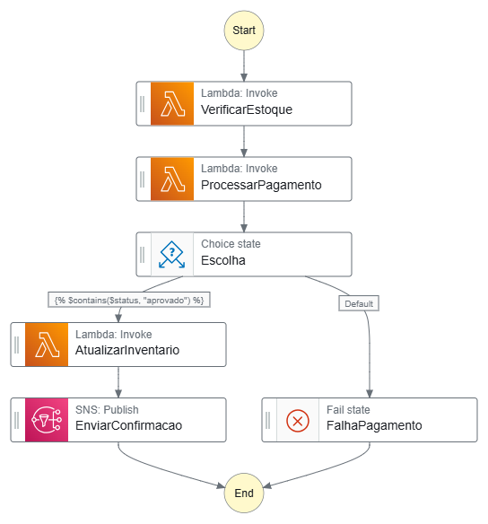

# Explorando Workflows Automatizados com AWS Step Functions

Estudo em: October 29, 2025

Ele é um serviço de fluxo de trabalho *serverless* (sem servidor) que permite criar aplicativos distribuídos, automatizar processos e orquestrar microsserviços usando fluxos de trabalho visuais.

### Principais conceitos

| **Conceito** | **Explicação** |
| --- | --- |
| **State Machine (Máquina de Estado)** | O fluxo de trabalho inteiro que você define. É o "diagrama" completo de todas as etapas. |
| **State (Estado)** | Uma única etapa dentro do fluxo de trabalho. Cada Estado executa uma ação, como invocar uma função Lambda ou tomar uma decisão. |
| **Task (Tarefa)** | Um tipo de Estado que chama um serviço AWS, como uma função Lambda, uma instância EC2, ou um contêiner. É o "trabalho" real que está sendo feito. |
| **Transições** | As regras que definem para qual próximo Estado o fluxo deve ir após a conclusão do Estado atual. |
| **Input/Output** | Os dados (em formato JSON) que são passados de um Estado para o próximo. |

### Tipos de Fluxo de Trabalho

- **Standard (Padrão):** Ideal para fluxos longos (até 1 ano), auditáveis e que exigem coordenação complexa. Paga-se por transição de estado.
- **Express (Expresso):** Ideal para fluxos de alta taxa e curta duração (até 5 minutos), como backends de IoT ou microsserviços de alto volume. Paga-se por execução.

### Características

- **Workflow visual** (quase zero código)
- Suporta **paralelo, loops, condição IF/ELSE**
- **Retentativas automáticas em caso de erro**
- Log centralizado do processo inteiro (opa, auditoria!)
- Integra direto com **Lambda, SQS, SNS, DynamoDB, ECS, API Gateway, quase tudo da AWS**

> 📌 AWS Step Functions é um orquestrador visual que permite criar workflows automáticos entre serviços AWS — controlando a ordem das etapas, as condições, os fluxos alternativos e o tratamento de erros — tudo sem precisar escrever código de controle manual.

### Por que usar o Step Functions?

| **Benefício** | **Explicação** |
| --- | --- |
| **Orquestração Visual** | Você define o fluxo em um diagrama, que é convertido em código (JSON ASL). Isso facilita a compreensão e a manutenção. |
| **Gerenciamento de Erros** | Ele lida automaticamente com *Retries* (tentar novamente) e *Catch* (capturar erros), eliminando a necessidade de escrever esse código complexo. |
| **Durabilidade** | O Step Functions rastreia o estado da sua aplicação, garantindo que mesmo que uma função Lambda falhe ou expire, o fluxo pode ser retomado ou o erro pode ser tratado de forma limpa. |
| **Integração com AWS** | Ele se integra nativamente com a maioria dos serviços da AWS, como Lambda, ECS, DynamoDB, SageMaker e muitos outros. |

## Primeira Step Function

### Exemplo de fluxo: Processamento de pedido

Imagine que uma empresa de e-commerce recebe um pedido e precisa executar as seguintes etapas em ordem:

1. Verificar se o produto está em estoque.
2. Processar o pagamento.
3. Se o pagamento falhar, tentar novamente (Retry).
4. Se o pagamento for bem-sucedido, atualizar o inventário.
5. Notificar o cliente.

