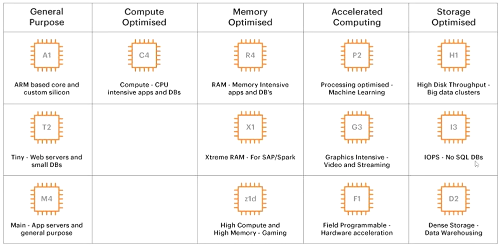

# Amazon EC2

Data: September 15, 2025

Website: https://calculator.aws/#/estimate

# O que são instâncias EC2

- O **Amazon EC2 (Elastic Compute Cloud)** é um serviço da AWS que te dá **máquinas virtuais na nuvem**.
- Em vez de comprar um servidor físico, você **aluga** um servidor que roda na AWS.
- Podendo ser com sistema operacional Windows ou Linux.

### Como funciona

1. **Você escolhe uma instância** (tipo de servidor):
    - Quantidade de CPU, memória, armazenamento, rede etc.
2. **Liga/desliga** quando quiser (paga só pelo tempo que usa).
3. **Instala o que quiser**: pode rodar sites, APIs, bancos de dados, programas, etc.

É igual ao seu PC, só que na nuvem e com escalabilidade.

No modelo Cloud, uma EC2 é do tipo IAAS ou seja, quando criamos uma EC2 estamos utilizando o tipo Infraestrutura como serviço.

- As imagens de máquina da Amazon estão disponíveis para escolha no momento da criação
- Pode definir a segurança básica utilizando firewall incorporada do AWS, utilizar grupo de segurança, protocolo, porta, IPs de origem que permitem negar o acesso ás suas instâncias EC2

### Como escolher a EC2 correta para minha aplicação?

Escolher a instância certa não se trata apenas de selecionar um tipo aleatório, mas sim de entender as necessidades da sua aplicação e utilizar os recursos da nuvem de forma inteligente para alcançar eficiêncian operacional e econômica.

**1.  Entenda o que sua aplicação precisa**

Antes de escolher, responda:

- **É leve ou pesada?** (site simples vs. API com muitos acessos)
- **Usa mais CPU ou memória?** (processamento intenso vs. cache/banco de dados)
- **Precisa de GPU?** (IA, renderização, gráficos pesados)
- **Vai ter picos de acesso?** (precisa escalar rápido)

Isso já elimina 70% das dúvidas.

---

**2. Tipos de instância por categoria**

A AWS agrupa instâncias por propósito:

| Categoria | Para quê serve | Exemplos |
| --- | --- | --- |
| **T** (burstable) | Uso geral leve, barato (testes, sites simples, dev) | t3, t4g |
| **M** (general purpose) | Uso geral mais estável (apps, APIs médias) | m5, m6g |
| **C** (compute optimized) | Muito CPU, cálculos pesados | c5, c6g |
| **R** (memory optimized) | Muito uso de RAM (cache, banco de dados) | r5, r6g |
| **G/P** (GPU) | IA, Machine Learning, gráficos | g4, p3, p4 |
| **Storage optimized** | Leitura/gravação de disco muito rápida | i3, i4 |

---

**3. Ajuste o tamanho (vCPUs e RAM)**

Cada tipo tem tamanhos (small, medium, large, xlarge…).

Exemplo: `t3.micro` (baratinha) → `t3.large` (mais CPU/RAM).

>💡 Comece **menor** e **aumente** se precisar. A AWS facilita trocar depois.

---

**4. Preço vs. performance - modelos de pagamento que ajudam a economizar**

- **On-Demand**: Você paga uma taxa fixa por hora. É a opção padrão e mais flexível, ideal para aplicações com uso imprevisível.
- **Reserved**: compromisso de 1 ou 3 anos (bem mais barato). É uma desvantagem para quem não precisa usar a instância com frequência.
- **Savings Plans:** Comprometa-se a usar um certo valor por hora (ex: R$ 50/hora) por um ou três anos. Em troca, você recebe descontos significativos. Ótimo para cargas de trabalho previsíveis.
- **Spot**: Você aluga a capacidade ociosa da AWS com descontos de até 90%. A AWS pode retomar a instância a qualquer momento. Use apenas para tarefas que podem ser interrompidas sem problema, como análise de dados em lote.

---

**5. Dicas práticas**

- Se for **teste ou dev** → `t3.micro` ou `t4g.micro` (às vezes é grátis no Free Tier).
- Se for **API pequena/WordPress** → `t3.small` ou `m5.large`.
- Se for **processamento intenso** → `c5.large` ou `c6g.large`.
- Se for **banco de dados/cache pesado** → `r5.large` ou maior.
- Se for **IA** → `g4dn` ou `p3` (tem GPU).

# Tipos de instâncias

Cada tipo de instância oferece diferentes recursos de computação como memória e armazenamento e é agrupado em famílias de instâncias com base nesses recursos.

### Convenção do nome dos tipos de instância

c7gn.xlarge

- c → Instance family
- 7 → Instance generation
- g → Processor family
- n → Additional capability
- xlarge → Instance size

# Otimização de recursos

Quando falamos em otimização de recursos, estamos apontando para “custo”, ou seja, otimizar recurso é poupar custos na AWS.

Mesmo otimizando um recurso computacional, onde melhoramos o desempenho do sistema, estamos poupando custo, pois isto traz ganho para a nossa solução na nuvem.

**1. Escolha do tipo/tamanho certo**

- Comece com uma instância **menor** e **monitore**.
- Se estiver “no limite”, suba para uma maior.
- Evite começar muito grande: isso encarece sem necessidade.

💡 Use o **AWS Compute Optimizer**: ele analisa suas instâncias e recomenda tipos/tamanhos melhores.

---

**2. Monitore constantemente**

Use o **Amazon CloudWatch** para ver:

- CPU (%)
- Memória (se configurado)
- Rede
- Disco

Se CPU < 20% o tempo todo → sua instância está grande demais.

Se CPU > 80% constantemente → está pequena demais.

---

**3. Escalabilidade automática (Auto Scaling)**

Em vez de ter **1 instância gigante**, tenha **várias pequenas** que aumentam/diminuem conforme o tráfego.

- Menos gente acessando → menos instâncias
- Pico de acesso → sobe mais instâncias
    
    💡 Paga só pelo uso.
    
- Escalar Verticalmente
    - Significa acrescentar ou reduzir capacidade de um recurso em um mesmo nó e geralmente está relacionado a alterar o número de vCPUs, memória, storage, rede de uma instância.
- Escalar Horizontalmente
    - É quando você aumenta o número de recursos. Por exemplo, adicionando mais um disco rígido, adicionando mais uma instância para suportar a aplicação.

---

**4. Escolha certo o armazenamento**

- **EBS gp3** (geral): mais barato que gp2.
- Use volumes menores e aumente só quando precisar.
- Se precisar de muito I/O (banco de dados), considere instâncias **storage-optimized**.

---

**5. Automatize desligamentos**

Desligue instâncias fora do horário comercial ou crie **scripts**/AWS Lambda para parar/ligar automaticamente.

Em ambientes produtivos não há a necessidade, mas em ambientes como de desenvolvimento, testes, treinamento, geralmente não são utilizados nos períodos noturnos ou finais de semana e podem ser desligados.

Uma menor utilização implica diretamente em economia de custos.

---

**6. Remover recursos ociosos ou não utilizados**

É comum criarmos recursos e não verificar a utilização e ficarmos com vários recursos ociosos no ambiente. Isto gera, recursos ociosos, parados em nosso ambiente gera gasto.