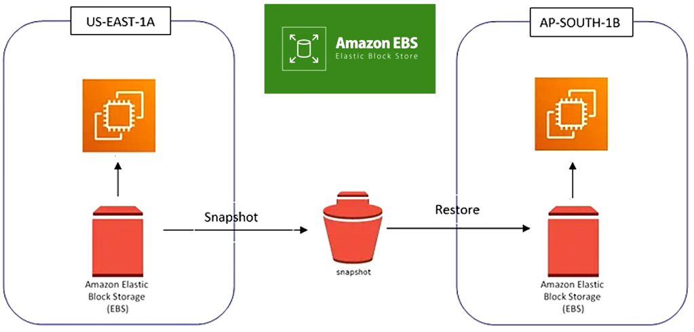

# Armazenamento na Nuvem com Amazon EBS e S3

Revisado: No
Tags: Santander Code Girls - 2025
Data: September 22, 2025
Website: aws.amazon.com/pt/s3/storage-classes/#topic-3

## Amazon EBS (Elastic Block Store)

Em termos mais simples, pense no EBS como um **disco rígido virtual** que você pode anexar a uma máquina virtual (instância EC2) na nuvem. A grande diferença para o disco de um computador físico é que o EBS oferece maior flexibilidade, durabilidade e escalabilidade.

- Conseguimos ter a capacidade de expansão de forma rápida, com apenas alguns clicks.

### Snapshots

Uma das funcionalidades mais poderosas do EBS são os **snapshots**. Eles são cópias pontuais de seus volumes EBS, que são armazenadas de forma durável no Amazon S3. Você pode usar os snapshots para:

- **Backup de dados**: Criar backups regulares para recuperação de desastres.
- **Migração**: Mover dados entre diferentes regiões ou contas da AWS.
- **Criação de novas instâncias**: Criar uma nova instância EC2 a partir de um snapshot, com os mesmos dados e configurações.

Exemplos de uso:

- Armazenamento para banco de dados, como MySQL, PostgreSQL e Oracle.
- Armazenar dados para aplicativos web e logs de sistema.

## Amazon S3 (Simple Storage Service)

É um **serviço de armazenamento na nuvem da AWS**. Ele funciona como um**grande “HD na nuvem”**, onde você pode guardar praticamente qualquer tipo de arquivo: imagens, vídeos, documentos, backups, logs, etc.

É ideal para armazenar, organizar e recuperar grandes volumes de dados de forma segura e escalável.

### Características principais

- **Armazenamento de objetos:**
    
    Diferente de um sistema de arquivos comum (com pastas), ele guarda dados como **objetos** dentro de **buckets** (buckets = “baldes” = pastas principais).
    
    - Cada **objeto** = arquivo + metadados + chave única (nome).
- **Escalável:**
    
    Não há limite prático de armazenamento. Pode crescer conforme você precisa.
    
- **Alta durabilidade e disponibilidade:**
    
    AWS garante 99,999999999% (11 noves) de durabilidade dos dados.
    
- **Acesso via web:**
    
    Você envia e recupera arquivos usando API HTTP/HTTPS, SDKs ou pela console da AWS.
    

### Tipos de armazenamento (Storage Classes)

Não paga pelo upload do arquivo mas sim pela leitura.

Podemos utilizar regra de ciclo de vida para definir a forma como o Amazon S3 gere os objetos durante o seu tempo de vida. O Lifecycle permite fazer a transição de objetos e migrar automaticamente para a classe Glacier

| Storage Class | Uso Ideal | Recuperação | Custo |
| --- | --- | --- | --- |
| **S3 Standard** | Dados acessados com frequência. (arquivos de uso diário) | Imediata | Mais caro |
| **S3 Standard-IA** *(Infrequent Access)* | Dados acessados raramente, mas que precisam estar disponíveis rapidamente. (backups mensais) | Imediata | Mais barato que Standard |
| **S3 One Zone-IA** | Igual ao Standard-IA, mas armazenado em **uma única zona de disponibilidade** (menos redundância). | Imediata | Ainda mais barato |
| **S3 Intelligent-Tiering** | AWS muda automaticamente seu objeto entre classes (Standard e IA) baseado no uso, para otimizar custo. | Automática | Você paga uma pequena taxa pelo monitoramento, mas economiza no geral |
| **S3 Glacier Instant Retrieval** | Arquivos arquivados, mas que você pode precisar acessar **imediatamente**. | Imediata | Bem barato |
| **S3 Glacier Flexible Retrieval** | Arquivos arquivados a longo prazo, acesso **demora alguns minutos a horas**. | Lento (minutos/horas) | Muito barato |
| **S3 Glacier Deep Archive** | Arquivos que quase nunca serão acessados (ex.: retenção legal por 7 anos). | Lento (horas) | O mais barato |

