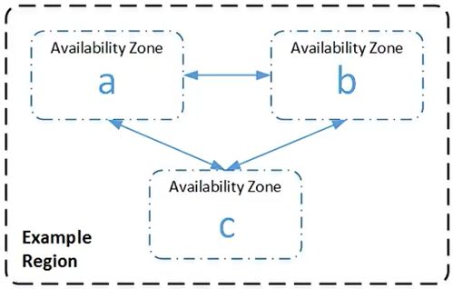

# Conceitos Fundamentais

Data: September 1, 2025

# Regiões

Cada região (region) é projetada para ser isolada das outras regiões. Isso proporciona a maior tolerância a falhas e estabilidade possível.

> 📌 Uma região é composta por 2 ou mais zonas de disponibilidade.

A AWS possui uma extensa rede global de data centers, chamados de “**Regions**” e “**Availability Zones**”.

Alguns pontos que devemos levar em consideração, quando for escolher uma região:

- Compliance
- Disponibilidade de Serviços
- Custo
- Latência

# Zona de Disponibilidade

Cada região é independente das demais regiões, o que significa que os recursos são exclusivos da região escolhida em que está sendo provisionado os recursos. Isto contribui para maior tolerância a falhas e não há replicação automática entre as regiões, isto deve ser habilitado pelo administrador da conta.

Ao criar uma conta na AWS você ganha acesso a diversas regiões, permitindo iniciar instâncias do Amazon EC2 em locais estratégicos para suas operações. Podemos por optar por executar instâncias na Europa para estar mais próximo de seus clientes ou para atender a requisitos específicos.

Avaibility Zones: São data centers independentes fisicamente, mas conectados logicamente, para garantir alta disponibilidade, e estão em uma região.

# Serviços Gerenciados

| **Serviço AWS** | **Recursos** | **Finalidade / Descrição** | **Responsabilidade AWS** | **Responsabilidade do Cliente** |
| --- | --- | --- | --- | --- |
| **Amazon EC2** (IaaS) | Máquinas virtuais, instâncias, rede, storage | Servidores virtuais sob demanda. | Infraestrutura física, disponibilidade, segurança da nuvem. | Configuração do SO, patches, segurança dentro da instância, apps. |
| **Amazon S3** (IaaS/SaaS) | Buckets, objetos, versionamento, políticas | Armazenamento escalável de objetos (arquivos, imagens, backups). | Infraestrutura, replicação, durabilidade, segurança física. | Configuração de buckets, permissões (IAM), gestão de dados. |
| **Amazon RDS** (PaaS) | Bancos (MySQL, PostgreSQL, SQL Server etc.) | Banco de dados relacional gerenciado. | Provisionamento, patching, backups automáticos, alta disponibilidade. | Definir modelo de dados, queries, índices, segurança lógica. |
| **Amazon Aurora** (PaaS) | Banco relacional compatível com MySQL e PGSQL | Banco de dados relacional de alta performance e totalmente gerenciado. | Infraestrutura, backups, replicação, escalabilidade. | Modelagem, queries, segurança lógica. |
| **AWS Lambda** (PaaS) | Funções serverless | Executa código sob demanda sem gerenciar servidores. | Escalabilidade automática, execução do código, disponibilidade. | Escrever código, definir triggers, permissões. |
| **Amazon DynamoDB** (PaaS) | Banco NoSQL | Banco de dados NoSQL totalmente gerenciado. | Infraestrutura, escalabilidade, replicação, backup. | Modelagem de dados, regras de acesso, consultas. |
| **Amazon CloudFront** (SaaS) | CDN, distribuição global de conteúdo | Distribui conteúdo (sites, vídeos, APIs) com baixa latência. | Rede global, disponibilidade, cache nos edge locations. | Configuração de cache, políticas de distribuição, segurança. |
| **Amazon EKS** (PaaS) | Kubernetes gerenciado | Orquestração de containers com Kubernetes. | Plano de controle, upgrades do cluster, escalabilidade. | Deploy de apps, pods, políticas de segurança. |
| **Amazon ECS** (PaaS) | Orquestração de containers | Executar containers Docker na AWS. | Infraestrutura e escalabilidade. | Deploy dos containers, definição de serviços e tarefas. |
| **Amazon VPC** (IaaS) | Redes virtuais, subnets, security groups | Rede isolada na nuvem para hospedar recursos. | Infraestrutura de rede. | Configuração de subnets, roteamento, regras de firewall. |
| **AWS IAM** (SaaS) | Usuários, roles, políticas, permissões | Gerenciamento de identidade e acesso. | Infraestrutura de autenticação e autorização. | Criar usuários, definir papéis e boas práticas de segurança. |
| **Amazon CloudWatch** (SaaS) | Logs, métricas, alarmes | Monitoramento e observabilidade de recursos. | Coletar e armazenar métricas, disponibilidade. | Definir métricas, alarmes e responder a incidentes. |
| **AWS Elastic Beanstalk** (PaaS) | Deploy automático de apps | Serviço para deploy de aplicações sem gerenciar infraestrutura. | Provisionamento automático de servidores, balanceamento, escalabilidade. | Subir código, configurar variáveis de ambiente, otimizar app. |
| **Amazon SNS** (SaaS) | Notificações e mensagens | Serviço de mensageria para enviar notificações. | Infraestrutura de entrega, escalabilidade. | Configurar tópicos, permissões e assinaturas. |
| **Amazon SQS** (SaaS) | Fila de mensagens | Serviço de filas para desacoplar sistemas distribuídos. | Gerenciar filas, alta disponibilidade, escalabilidade. | Configurar lógica de consumo, processar mensagens. |
| **AWS Glue** (PaaS) | ETL, catálogo de dados | Serviço gerenciado de ETL para análise de dados. | Infraestrutura, orquestração de jobs. | Definir transformações, pipeline de dados, permissões. |
| **Amazon Redshift** (PaaS) | Data warehouse | Análise de grandes volumes de dados (OLAP). | Provisionamento, patching, escalabilidade. | Modelagem de dados, queries analíticas, ingestão de dados. |
| **Amazon Kinesis** (PaaS) | Streaming de dados em tempo real | Captura, processamento e análise de streams de dados. | Infraestrutura, ingestão em escala. | Processamento, regras de negócio e análise dos dados. |