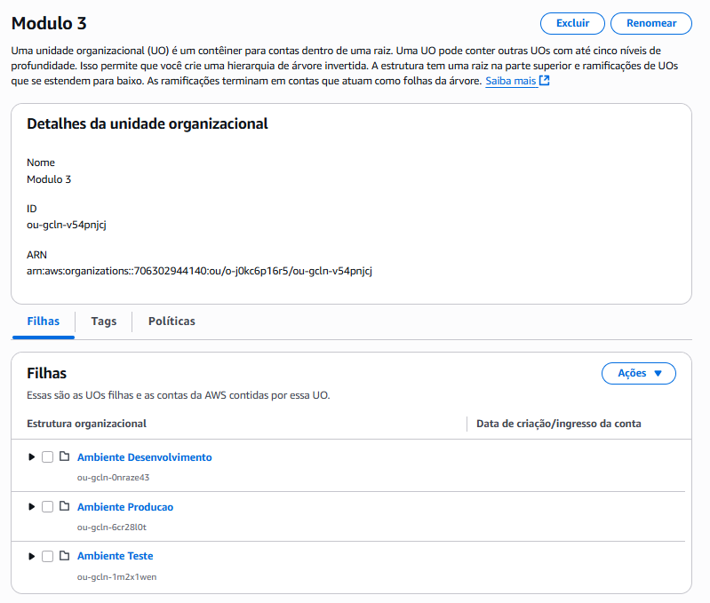

# Criando Instância Amazon EC2

Data: September 24, 2025

Website: https://docs.aws.amazon.com/pt_br/AWSEC2/latest/UserGuide/EC2_GetStarted.html

## Unidade Organizacional (OU)

Uma **Unidade Organizacional (OU)** é simplesmente um **contêiner (uma pasta)** que você usa para agrupar e organizar suas contas da AWS. Você pode, inclusive, ter OUs dentro de outras OUs, criando uma hierarquia.

| Característica | Descrição |
| --- | --- |
| O que é? | Um contêiner (uma pasta) para organizar contas da AWS. |
| Custo? | Gratuito. |
| Principal Poder? | Aplicar políticas (SCPs) em várias contas de uma só vez. |
| Principal Uso? | Organizar, governar e proteger seu ambiente AWS em escala. |
| Afeta o Free Tier? | Não. Apenas organiza as contas que já compartilham o mesmo Free Tier. |

> ⚠️ Importante configurar um par de chaves para conexão via SSH

## **MobaXterm**

Ele serve para centralizar em **um único programa** várias ferramentas que você normalmente precisaria instalar e usar separadamente para se conectar e gerenciar servidores remotos (principalmente sistemas Linux/Unix).

### Principais Funcionalidades

- **SSH integrado**: conectar-se a servidores Linux/Unix facilmente.
- **SFTP automático**: ao abrir uma sessão SSH, ele já mostra os arquivos do servidor em uma aba lateral (arrastar e soltar arquivos!).
- **Multi-session**: gerencia várias conexões (SSH, RDP, FTP, etc.) ao mesmo tempo.
- **X11 forwarding**: permite abrir aplicações gráficas Linux no Windows.
- **Várias ferramentas UNIX incluídas**: `bash`, `ls`, `grep`, `curl`, `nano`… sem precisar instalar WSL ou Cygwin.
- **Interface simples**: janelas e abas para cada conexão.
- **Suporte a plugins**: dá para adicionar mais ferramentas ou comandos.

Instâncias Linux e Windows criadas:

## Passo a passo para conectar a uma instância EC2 Windows usando RDP (Protocolo de Área de Trabalho Remota)

### **Etapa 1: Preparação e Verificação na AWS**

Antes de tentar conectar, garanta que os pré-requisitos abaixo estão corretos. A maioria dos problemas de conexão acontece aqui!

### ✅ 1. Verifique se a Instância está em Execução

No Console da EC2, encontre sua instância e verifique se o **"Status da instância"** está como **"running"** (em execução).

### ✅ 2. Verifique o Endereço IP Público

Ainda no console, selecione a instância. No painel de detalhes, anote o **"Endereço IPv4 público"** ou o **"DNS IPv4 público"**. Você precisará disso para se conectar.

### ✅ 3. Configure o Security Group (Grupo de Segurança) - **MUITO IMPORTANTE!**

O Security Group funciona como um firewall para sua instância. Você precisa permitir o tráfego RDP.

1. Selecione a instância e clique na aba **"Segurança"**.
2. Clique no nome do Security Group associado (algo como `sg-0123abc...`).
3. Na página do Security Group, clique em **"Editar regras de entrada"** (Edit inbound rules).
4. Verifique se existe uma regra como esta:
    - **Tipo:** `RDP`
    - **Protocolo:** `TCP`
    - **Intervalo de portas:** `3389`
    - **Origem (Source):**
        - **🔐 Mais Seguro:** `Meu IP` (My IP). Isso permite que apenas o seu computador (da sua rede atual) se conecte.
        - **⚠️ Menos Seguro:** `Qualquer lugar-IPv4` (`0.0.0.0/0`). Permite que qualquer computador no mundo tente se conectar. **Use isso apenas para testes rápidos e nunca em produção.**
5. Se a regra não existir, clique em **"Adicionar regra"**, preencha os dados e salve.

### **Etapa 2: Obter a Senha de Administrador**

A AWS gera uma senha aleatória para a sua instância Windows, e você precisa usar seu par de chaves (`.pem`) para decifrá-la.

1. No console da EC2, selecione sua instância Windows.
2. Clique no botão **"Conectar"** no canto superior direito.
3. Vá para a aba **"Cliente RDP"**.
4. Clique no botão **"Obter senha"**. (Se a instância acabou de ser criada, talvez você precise esperar alguns minutos).
5. Clique em **"Fazer upload do arquivo de chave privada"** e selecione o arquivo `.pem` que você usou ao criar a instância.
6. Clique em **"Descriptografar senha"**.

>🔑 A senha do administrador será revelada. **Copie e guarde-a em um lugar seguro.**

### **Etapa 3: Conectar Usando o Cliente de Área de Trabalho Remota**

Agora, com o IP e a senha em mãos, vamos conectar.

1. **Abra o Cliente de Área de Trabalho Remota** no seu computador Windows.
    - Aperte as teclas `Win + R`.
    - Digite `mstsc` e aperte Enter.
2. **No campo "Computador",** cole o **Endereço IP público** ou o **DNS público** da sua instância que você anotou na Etapa 1.
3. Clique em **"Conectar"**.
4. Uma janela pedirá suas credenciais.
    - **Nome de usuário:** `Administrator`
    - **Senha:** Cole a senha que você descriptografou na Etapa 2.
5. Pode aparecer um aviso sobre o certificado de segurança. Isso é normal. Marque a caixa **"Não perguntar novamente sobre conexões com este computador"** e clique em **"Sim"**.