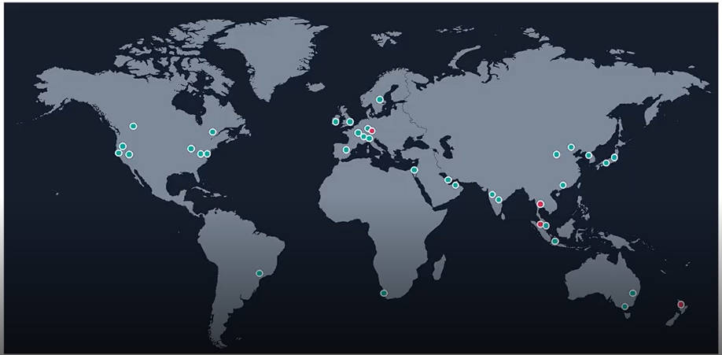

# Visão Geral da AWS

Data: September 1, 2025

Website: https://aws.amazon.com/pt/about-aws/global-infrastructure

# História da AWS

Fundada em 1994 somente como uma loja de livros na internet, a Amazon se tornou uma gigante da tecnologia sob comando de seu fundador Jeff Bezos.

Foi ele quem decidiu batizar a empresa em referência à região, mais especificamente ao rio Amazonas.

O nome foi escolhido após Bezos buscar palavras com a letra “A” no dicionário e ver que “Amazon” era descrito como o “**maior rio da Terra**”, escreveu Brad Stone, autor do livro “A Loja de Tudo: Jeff Bezos e a era da Amazon”.

A Amazon Web Services (AWS) foi lançada pela Amazon em 2006 como uma resposta à necessidade de oferecer serviços de infraestrutura em nuvem.

# Infraestrutura Global

A infraestrutura global da AWS é a mais segura, abrangente e confiável plataforma de nuvem. Pioneira de tudo.   

E oferece mais de 200 serviços em todo o mundo. Se você precisar implantar workloads de aplicações em todo o mundo próximos dos usuários finais com latência inferior a 10 milissegundos.

A AWS fornece a infraestrutura de nuvem onde e quando você precisar.

Ela possui uma extensa rede global de data centers, chamados de “Regions” e “Availability Zones”.

- Regions: São áreas geográficas contendo várias Availability Zones.
- Availability Zones: São data centers independentes fisicamente, mas conectados logicamente, para garantir alta disponibilidade.
    - No mínimo 2, e no máximo 3 data centers.

### Mapa da infraestrutura AWS

**A Nuvem AWS abrange 120 Zonas de disponibilidade em 38 Regiões geográficas, com planos anunciados para mais 10 Zonas de disponibilidade e mais 3 Regiões da AWS em a Reino da Arábia Saudita, Chile e a Nuvem soberana europeia da AWS.**

# Modelo de Negócio da AWS

Assim como os demais Cloud Service Provider do mercado o foco do modelo de negócio da AWS é o pagamento por uso, isso é o que difere o modelo Cloud dos demais modelos antigos como Data Centers.

Chamamos o modelo Cloud de OPEX, pois não necessitamos de uma grande infraestrutura para iniciar um projeto.

Diferente do modelo CAPEX que precisamos de uma infraestrutura física para começar o projeto.

- Pricing Flexível: A AWS oferece um modelo de pagamento conforme o uso, permitindo que os clientes paguem apenas pelos recursos que consomem.
- Grande Variedade de Serviços:  Desde computação, armazenamento e banco de dados até serviços especializados como machine learning, IoT e análise de dados.

### Diferença entre OPEX e CAPEX

- **CAPEX (Capital Expenditure)** → Gasto em **investimento de longo prazo** (ex.: comprar um servidor, construir um prédio).
- **OPEX (Operational Expenditure)** → Gasto em **manutenção e operação do negócio** (ex.: pagar AWS todo mês, contas de energia).

<aside>

>💡 OPEX é super importante porque você paga **por uso mensal** em vez de comprar servidores (que seria CAPEX).

</aside>

|  | Pública  | Híbrida | Privada |
| --- | --- | --- | --- |
| Maior risco de privacidade | ✅ | ❌ | ❌ |
| Alto desempenho | ✅ | ✅ | ❌ |
| Acesso imediato | ✅ | ✅ | ❌ |
| Baixo custo | ✅ | ✅ | ❌ |
| Escalabilidade | ✅ | ✅ | ❌ |
| Segurança | ❌ | ✅ | ✅ |
| Controle total | ❌ | ✅ | ✅ |
| Alto investimento | ❌ | ❌ | ✅ |
| Custo contínuo da operação | ❌ | ❌ | ✅ |

## Modelos de computação na Nuvem

Nós temos Iaas - Paas - Saas que são siglas usadas para descrever os modelos de serviço de computação em nuvem. Cada modelo oferece um nível diferente de controle e responsabilidade para o usuário.

**SaaS - Software como Serviço USE**
- E-mail
- CRM
- ERP
- Netflix
- Spotify

**PaaS - Plataforma como Serviço CONSTRUA**

- Desenvolvimento de aplicação
- Streaming Web
- Decisões de suporte
- SQL Server

**IaaS - Infraestrutura como Serviço MIGRE**

- Sistema legado
- Servidor de arquivos
- Segurança
- Sistema de gerenciamento
- Sistema de Cache
- Instância

A AWS se destaca não apenas pela sua infraestrutura global robusta, mas também pela capacidade de inovação constante e adaptação às necessidades do mercado.

Isso a torna uma escolha preferida para empresas de todos os tamanhpos e setores.

Amazon Web Services

1. **Aumentando recursos** de TI, usando a capacidade da nuvem.
2. **Migrando** aplicativos existentes e dados para a nuvem
3. **Construindo novos** aplicativos, sites, serviços e linhas de negócios